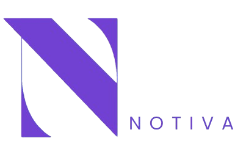

# Notiva

Fast, beautiful, and private markdown note-taking in your browser.



## Features

- ✍️ **Write in Markdown** — Enjoy distraction-free writing with full Markdown support.
- 👀 **Live Preview** — Instantly see your formatted notes as you type.
- 🌙 **Dark/Light Mode** — Switch themes for day or night.
- 💾 **Auto-save** — Notes are saved automatically in your browser (localStorage).
- 📄 **Multiple Notes** — Create, rename, and delete as many notes as you want.
- ⬇️ **Download** — Export your notes as `.md` files.
- 🔒 **Privacy First** — Your notes never leave your device.


### Installation

Clone the repository:

```sh
git clone https://github.com/ishwari03/Notiva.git
cd Notiva
```


## Usage

- Create a note: Click "+ New Note" in the sidebar.
- Rename: Double-click a note title.
- Delete: Click the 🗑️ icon next to a note.
- Download: Click the download icon in the navbar.
- Switch theme: Use the sun/moon toggle.
- Help: Click the info icon for usage tips.

  
## Tech Stack

- React
- Vite
- marked (Markdown parser)
- react-icons


License
MIT

